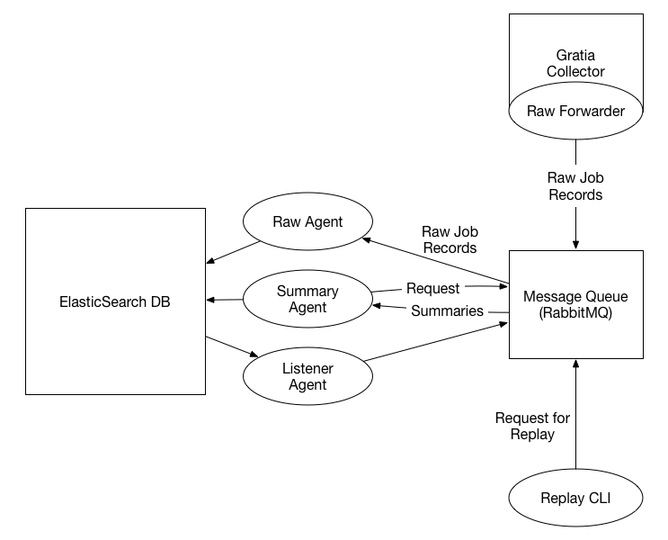

# Agent Architecture

The agents that coordinate for GRACC

---

Unlike its predecessor Gratia, GRACC is split into a number of agents that coordinate through a message queue.  The intent is that this separates the distinct components into separate modules that can evolve at independent rates.  Further, it provides a mechanism for external entities interested in accounting data to integrate into the system.

Components
----------

The three major centralized components of GRACC include:

* Message queue: A [RabbitMQ](https://www.rabbitmq.com/) service for exchanging messages between system components.  Utilized for its publish-subscribe model and its standardized wire format.
* `GRACC` - a centralized collector endpoint.  This is a HTTP-based service that listens for incoming records from legacy probes or  Gratia collectors and sends them to the message queue.
* `GRACE` - an [ElasticSearch](https://www.elastic.co/)-based data storage service.  Consists of an ElasticSearch database instance and several agents used to populate the system.

Other pieces of the accounting infrastructure include the site probes (which produce the records) and planned web views of the accounting data (likely based on Grafana or Kibana).

We also plan on developing `gracc-replay`, a command-line tool for initializing replay of data in the system.  This is meant to:

* Upload Gratia raw record tarballs from disk to the message queue.
* Request raw data to be resent from a given `GRACE` instance to a message queue destination (likely a second `GRACE` instance).
* Request summary data to be recalculated from a given `GRACE` instance to a message queue destination.

Agents
------

## Raw Agent

An agent which listens to one or more message queues (typically, its own queue for replay information and one or more collector queues) for raw records.  Records are read off the queue and uploaded to the database.

## Summary Agent

This agent has two responsibilities:

   * Listening to a message queue (`/grace.<db>.summary`) for summary records.  It fetches the records from the queue and uploads them into ElasticSearch.  This is implemented in Logstash.
   * Periodically request new summaries be made by the Listener agent.  The current behavior of the summarizer is

      * Every 15 minutes, we re-summarize the past 7 days of data.

The summary agent also comes with a command line option to re-summarize larger period of times.  The command line is `graccsummarizer`.  The `graccsummarizer` takes a date range as arguments, further help with the command line can be found with the help option.

## Listener Agent

A agent running on `GRACE`.  The listener agent listens for one-time data replication requests (for either raw or summary data) on the message queue and launches an appropriate sub-process to send the data to the requested destination.

It listens on the known queue `/gracc.<db>.requests` (as defined on [Message Queues](message-queues.md)).  

### Integrate OIM Information

The listener agent integrates OIM information for ProjectNames.  For each summary data request it performs these operations:

1. Download the Project information in XML from a OIM URL.
2. Parse the XML Project information into a hash keyed by the ProjectName.
3. For each summary record, search for the project information in the OIM hashed data structure, and append the information to the record.

The attributes copied to the record are:

* *PI Name* - The name of the principle investigator for the project.
* *Organization* - Institution or organization that the project belogs.
* *Department* - Department inside the institution.
* Field Of Science - Field of science inside the origanization.

We currently do not support the addition of "Sponsor Campus Grids".

Future components
-----------------

Components that will likely be needed in the future include:

* `GRACE-B`: Listens for raw records and serializes them to disk; on a daily basis, compact them into a tarball and upload them to archival storage.
* `GRACE-D`: A _dead letter queue_: a destination for any unparseable or otherwise-rejected records.
* Some destination for status information.  Every 15 minutes, each component should generate a short status update (analogous to a HTCondor daemon's ClassAd in a `condor_collector`) and serialize it to a database.

